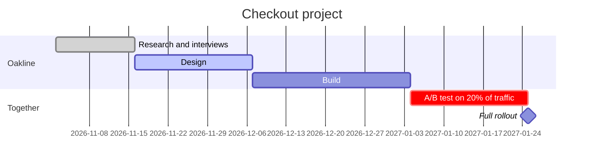

# A faster checkout for Harbor & Co.
# Goal: ==2.6% conversion== by February.

Proposal from Oakline Studio to the Harbor & Co. e-commerce team, October 2026. Edit anything on this page; we will turn the agreed version into the contract.

## 01 · Where you are
your analytics, last 90 days

> [!stats]
> - **2.1%** of visits end in an order
> - [!] **68%** of carts are abandoned
> - [!] **7** steps from cart to payment
> - **\$18M** online revenue a year

> [!cascade]
> - **100%** add to cart
>   every session that adds a product
> - **54%** start checkout
>   the rest leave from the cart page
> - **32%** reach payment
>   most leave at account creation and shipping
> - **27%** pay
>   card errors cost the last 5 points

> [!lineage] What this is worth
> Moving from 2.1% to 2.6% at today's traffic adds about \$4.3M in revenue a year.

## 02 · What we will do

> [!flow]
> - Research
> - Design
> - Build
> - A/B test
> - [x] Roll out to all traffic

1. **Guest checkout first.** An account is offered after payment, not before.
2. **Three steps, not seven.** Address, delivery and payment on one screen each.
3. **Wallets on top.** Apple Pay and Google Pay before the card form.
4. **Clear card errors.** Say what is wrong and keep what the shopper typed.

## 03 · Price and terms

> [!cards]
> - **Lite · \$38K** research and design only; your team builds it.
> - **Core · \$96K** research, design, build and the A/B test. Recommended.
> - **Plus · \$124K** Core, plus three months of tests after launch.

%% table cols="1.6fr 1fr 1fr 1fr" pillCol=2 %%
| Included | Lite | Core | Plus |
| --- | --- | --- | --- |
| Research and interviews | yes | yes | yes |
| Design | yes | yes | yes |
| Build | no | yes | yes |
| A/B test | no | yes | yes |
| Tests after launch | no | no | yes |

**Payment:** 40% at signing, 30% after design, 30% at rollout.

**From you:** one product owner, access to analytics and the staging site, a reply on designs within three working days.

**Valid until:** October 31, 2026.
