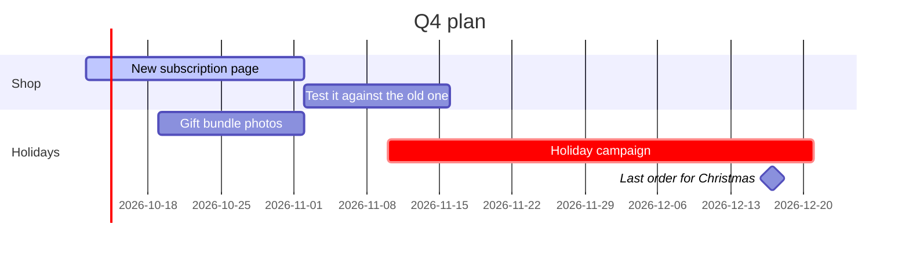

# Juniper Coffee × Northbeam, Q3 2026.
# Cost per new customer down ==22%==, online orders up 31%.

Quarterly results for the Juniper Coffee team from Northbeam Studio: the goals we set in July and what happened, what worked, and the plan for the next 90 days. July to September 2026; numbers from Shopify and the ad accounts on October 3.

## 01 · Results against goals

> [!stats]
> - [x] **\$412K** online revenue, goal \$380K
> - [x] **\$38** cost per new customer, goal \$45, was \$49
> - [x] **3.0x** return on ad spend, goal 3.0x
> - [!] **640** new subscriptions, goal 900

### By channel

%% table accentCol=3 cols="1.2fr 1fr 1fr 1fr 1.6fr" pillCol=4 %%
| Channel | Spend | Revenue | Return | Next quarter |
| --- | --- | --- | --- | --- |
| Google search | \$41K | \$118K | 2.9x | go: raise the budget 20% |
| Meta ads | \$58K | \$151K | 2.6x | keep, with new creative |
| Email and SMS | \$6K | \$97K | 16x | go: two more flows |
| Influencers | \$18K | \$27K | 1.5x | keep testing |
| Pinterest | \$14K | \$19K | 1.4x | stop |

### From ad to order

> [!cascade]
> - **286,000** visits to the shop
>   61% from paid channels
> - **14,900** carts
>   5.2% of visits
> - **9,820** orders
>   \$42 an order on average

## 02 · What worked, what didn't

### Worked

> [!cards]
> - **Search for "coffee subscription"** The new landing page halved the cost of a subscriber from search.
> - **Abandoned-cart emails** Three emails over two days brought back \$31K of carts.

### Didn't

> [!cards]
> - **Pinterest** Cheap clicks, few orders. We stop it and move the budget to search.
> - **The subscription page** 1.1% of visitors subscribe; similar shops reach 2.5%.

## 03 · Next 90 days

> [!cards]
> - **Rebuild the subscription page** Fewer choices, the first bag free, delivery dates shown before checkout.
> - **Holiday gift bundles** Three bundles from \$45, on sale from November 10.
> - **Search over Pinterest** The \$14K from Pinterest goes to the search terms that work.

> [!lineage] What we need from you
> Gift bundle prices by October 17. The holiday photos approved by October 30. A staff account in Shopify for the subscription app.

1. **Northbeam.** New subscription page live by November 2.
2. **Juniper.** Bundle prices and a staff account by October 17.
3. **Both.** A 30-minute check-in on the first Monday of each month.

**Next review:** January 12, 2027, with the holiday results.
