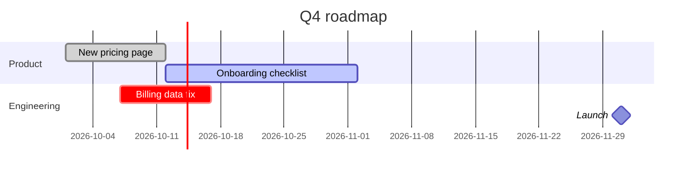

# One onboarding for every plan.
# Goal: ==60% finish setup by December==.

A sample page with every block type. Product team, October 2026.

## 01 · Where we are
numbers from the last 30 days

> [!stats]
> - **42%** finish setup today
> - [!] **\$12** cost per signup
> - [x] **x3** more trials since July

> [!cascade]
> - **1,200** signups a week
>   from the new landing pages
> - **500** finish setup
>   connect a data source

**Rule:** one owner per part, one number per goal.

### What we learned

> [!lineage] Setup is the drop-off
> Most people who leave never connect a data source.

1. **Ask less.** The signup form drops from six fields to two.
2. **Show value first.** A sample report opens before any setup.

## 02 · The plan

> [!flow]
> - Sign up
> - [Connect data ↗](https://example.com/docs/connect)
> - [x] First report

> [!cards]
> - **Guided setup** a checklist that follows the user
> - **Sample data** a full report before connecting anything

> [!uc]
> - **Teams** invite on day one
> - **Agencies** one setup, many clients
> - **Solo** done in five minutes

%% table accentCol=2 cols="1.2fr 1fr 1fr 110px" pillCol=3 %%
| Idea | Data says | Owner | Verdict |
| --- | --- | --- | --- |
| Shorter signup form | +8% in the test | Ana | Yes |
| Video tour | no change | Sam | No |

## 03 · Reference

> [!cmdcols]
> #### Commands
> - `npm run dev` start the app locally
> - [x] `npm test` run every test
>
> #### Docs [example.com/docs](https://example.com/docs)
> - `/setup` `/connect` first steps for a new account

> [!canvas]
> #### 2 · Problem %%p%%
> - Setup takes a week
>
> #### 4 · Solution %%s%%
> - Guided setup in one call
