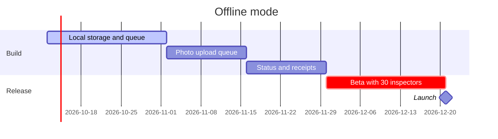

# Offline mode for the Fieldwise app.
# Goal: ==zero lost inspections== in the field.

Product brief, October 2026. Owner: product. Reviewers: engineering, design, support. Comment and edit here; this page is the spec.

## 01 · Problem
why now

> [!stats]
> - [!] **23%** of inspections happen with no signal
> - [!] **1 in 40** inspections lost to a failed upload
> - **31%** of support tickets are about sync
> - **4** of the last 10 lost deals named offline as the reason

> [!lineage] What users tell us
> "I finish a two-hour inspection in a basement, press submit, and it is gone. I write everything on paper first now." Facility inspector, interview 12.

## 02 · Goals and scope

> [!cards]
> - **Goal: nothing is lost** Every inspection is saved on the device before anything else happens.
> - **Goal: no new steps** Inspectors do not have to think about being offline.
> - **Non-goal: offline sign-up** New accounts still need a connection.

> [!flow]
> - Open inspection
> - Work with no signal
> - Saved on the device
> - Signal returns
> - [x] Synced, with a receipt

%% table cols="1.8fr 70px 110px" pillCol=2 %%
| Requirement | Priority | In v1 |
| --- | --- | --- |
| Inspections save on the device as they are filled | P0 | yes |
| Photos queue and upload in the background | P0 | yes |
| A clear status: saved, waiting, synced | P0 | yes |
| Two people edit one inspection offline | P1 | yes, but last edit wins |
| Download all of next week's sites in advance | P1 | yes |
| Offline reports and charts | P2 | no |

## 03 · Measure and ship

### How we know it worked

1. **Lost inspections.** From 1 in 40 to zero, measured by upload receipts.
2. **Sync tickets.** Down by half within 60 days of launch.
3. **Adoption.** 80% of active inspectors on the new version in 30 days.

> [!lineage] Biggest risk
> Two people editing the same inspection offline. v1 keeps the last edit and shows who changed what; real merging waits for v2.

