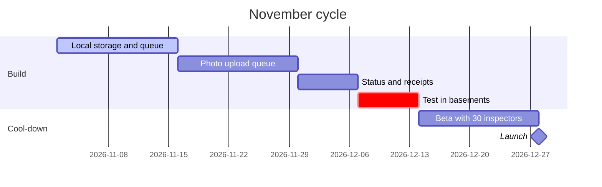

# Offline mode for the Fieldwise app.
# Six weeks to ==zero lost inspections==.

Product brief for the November cycle, written as a Shape Up pitch: the problem, how much time it is worth, the solution, the rabbit holes, and what is out. Owner: product. Reviewers: engineering, design, support. Comment and edit here; this page is the spec.

## 01 · Problem
why now

> [!stats]
> - [!] **23%** of inspections happen with no signal
> - [!] **1 in 40** inspections lost to a failed upload
> - **31%** of support tickets are about sync
> - **4** of the last 10 lost deals named offline as the reason

> [!lineage] What users tell us
> "I finish a two-hour inspection in a basement, press submit, and it is gone. I write everything on paper first now." Facility inspector, interview 12.

## 02 · Appetite
how much time it is worth

**Appetite:** six weeks, one designer and two engineers. If it does not fit, we cut scope, not add time.

**Done when:** an inspector finishes and submits an inspection with no signal, and it reaches the office when the signal returns, with nothing lost.

## 03 · Solution
the shape, not the screens

> [!flow]
> - Open inspection
> - Work with no signal
> - Saved on the device
> - Signal returns
> - [x] Synced, with a receipt

%% table cols="1.6fr 100px 1fr" pillCol=2 %%
| Element | Priority | In this cycle |
| --- | --- | --- |
| Inspections save on the device as they are filled | P0 | yes |
| Photos queue and upload in the background | P0 | yes |
| A clear status: saved, waiting, synced | P0 | yes |
| Two people edit one inspection offline | P1 | yes, but last edit wins |
| Download all of next week's sites in advance | P1 | yes |
| Offline reports and charts | P2 | no |

## 04 · Rabbit holes
risks we solve now, before they eat the six weeks

1. **Two people edit one inspection offline.** The last edit wins, and the inspection shows who changed what. Real merging waits for a later cycle.
2. **Hundreds of photos on a weak connection.** Uploads resume where they stopped, one photo at a time; the form never waits for them.
3. **Old Android phones with little storage.** Photos are compressed on the device; a warning shows below 500 MB free.

## 05 · No-gos
out of this cycle, on purpose

> [!cards]
> - **No offline sign-up** New accounts still need a connection.
> - **No offline reports** Charts and exports need the server.
> - **No merging edits** Last edit wins in this cycle.

### How we know it worked

1. **Lost inspections.** From 1 in 40 to zero, measured by upload receipts.
2. **Sync tickets.** Down by half within 60 days of launch.
3. **Adoption.** 80% of active inspectors on the new version in 30 days.

