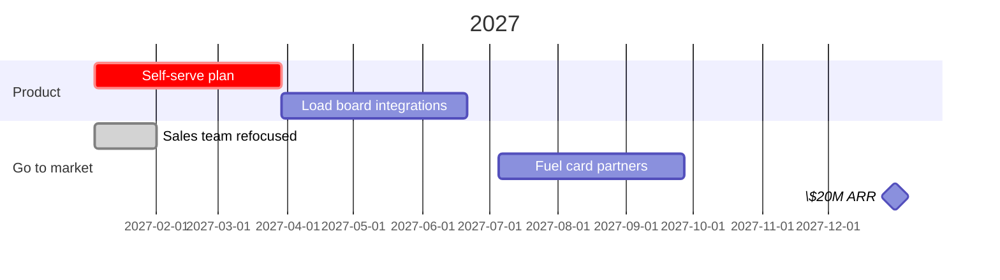

# Copperline in 2027.
# Win the ==mid-market==, not the enterprise.

Strategy memo for the board, October 2026. Diagnosis, the guiding policy, and the actions that follow from it. Copperline makes dispatch software for freight carriers.

## 01 · Diagnosis
what is really going on

> [!stats]
> - **\$11.4M** ARR, growing 34% a year
> - [!] **9 months** average enterprise sales cycle
> - [x] **27 days** average mid-market sales cycle
> - [!] **3** enterprise deals take 40% of engineering time

> [!lineage] The problem
> We sell to everyone. Enterprise deals are large, but slow and full of custom work. Carriers with 20–200 trucks buy fast, renew at 94%, and we under-serve them.

### Options we considered

%% table cols="1.4fr 1.6fr 110px" pillCol=2 %%
| Option | What it means | Verdict |
| --- | --- | --- |
| Double down on enterprise | hire a field sales team, build custom integrations | No |
| Mid-market, self-serve | carriers with 20–200 trucks, sign up without sales | Go |
| Expand to Europe | localize for two new markets | Later |

## 02 · Guiding policy

**Policy:** every product and sales decision in 2027 serves carriers with 20 to 200 trucks.

> [!uc]
> - **Stop** custom work for single customers
> - **Stop** RFPs that need on-premise hosting
> - **Keep** the three enterprise accounts, as they are
> - **Start** a self-serve plan with a free trial
> - **Start** integrations with the top five load boards
> - **Start** a partner program with fuel card companies

> [!canvas]
> #### 1 · Customer %%c%%
> - Carriers with 20–200 trucks
> - Owner or head of operations decides
>
> #### 2 · Problem %%p%%
> - Dispatch runs on phone calls and spreadsheets
> - Empty miles eat the margin
> ##### Existing alternatives
> - Spreadsheets, legacy TMS
>
> #### 3 · Value proposition %%u%%
> - Fewer empty miles in the first month
>
> #### 4 · Solution %%s%%
> - Load matching, driver app, invoicing
>
> #### 5 · Channels %%h%%
> - Load boards, fuel card partners
>
> #### 6 · Revenue %%r%%
> - \$45 per truck a month
>
> #### 7 · Costs %%k%%
> - Engineering, onboarding, partner fees
>
> #### 8 · Key metrics %%m%%
> - Trucks under management, 90-day retention
>
> #### 9 · Unfair advantage %%a%%
> - Six years of lane pricing data

## 03 · Coherent actions
what we do in 2027

1. **Self-serve plan in Q1.** Sign-up, trial and card payment without a sales call.
2. **Load board integrations in Q2.** The five boards our customers use most.
3. **Fuel card partners in Q3.** Two partners selling Copperline to their carriers.
4. **Sales team refocused.** Four account executives move from enterprise to mid-market.

**Goal:** \$20M ARR at the end of 2027, with 60% of new revenue from carriers under 200 trucks.
