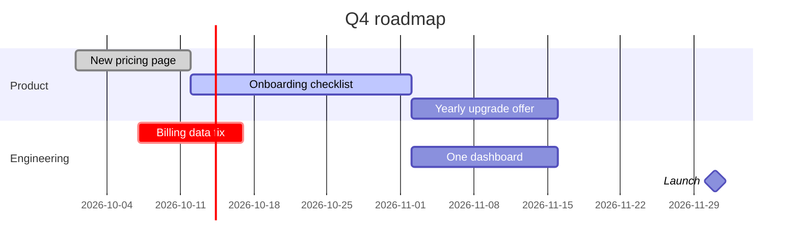

# Writing a MyOnePage

A MyOnePage is one Markdown note. In Obsidian, the MyOnePage plugin opens a note with `myone.page: true`
in its frontmatter as a styled page that can be edited in place (Obsidian's editing and reading views stay
one click away). Every edit on the page rewrites the file in the canonical form shown here.

**Where it goes.** Anywhere in the vault, filed like any other note. Follow the vault's own conventions
(its `CLAUDE.md`, if it has one) for folder and file name.

**Example to copy from:** `examples/one-pager.md` in the plugin repository uses every block type.

## Workflow

1. Write the file in the format below.
2. Check it with the checker from the plugin repository (Node 18 or later, no install):
   `node <repo>/check.mjs <file>`; add `--fix` to rewrite it in canonical form.
   Pass the note's path only: a folder glob also checks ordinary notes, which are not MyOnePage pages.
   - `error` lines must be fixed. `warn` lines are usually a block that fell back to plain text.
   - `info: … plain text, not a styled block` lists every `p` block. Confirm each one is meant to be plain.
   - `not formatted` is harmless: run it again with `--fix` to rewrite it canonically.
3. If the page is open in Obsidian it picks up your change by itself; if not, the owner presses ⟳ in the
   tab header. If they edited before that, the page refuses to save ("the file changed on disk") rather
   than overwrite your change.

## The page

```markdown
---
title: Onboarding · Q4
updated: 2026-10-07
lang: en
myone.page: true
---

# One onboarding for every plan.
# Goal: ==60% finish setup by December==.

Who it is for, date, sources. This paragraph is the subtitle.

## PART 1 · Where we are
note shown on the right of the divider

### Small uppercase heading

**Lead:** one line: bold lead, then the text.
```

- Frontmatter: `myone.page: true` (Obsidian opens the note as the page; without it the note opens as
  plain Markdown), `title` (tab title), `updated` (`YYYY-MM-DD`, bumped on every save from the page),
  `lang` (default `ru`; set it), `view` (`tabs` opens the page as one tab per section; default `scroll`).
  Other keys (`tags`, `aliases`…) are kept as they are.
- Sharing on the web (synced by the plugin, when the owner has set up a sharing server): `share: new`
  publishes the note and becomes `share: https://<server>/p/<account>/<id>#k=<key>`, the full link (the part
  after `#` is the key the page is encrypted with; never shorten or edit it, and treat the link as a secret).
  `editors:` and `viewers:` are lists of emails, `"@domain"`s (quoted), or `anyone` (whoever has the link;
  readers need no sign-in). Only the owner sets these three; they never reach the web copy. Never add
  `share:` unless asked: it puts the page online. Removing `share:` takes it offline; `share: new` again
  gives it a new link and the old one stops working.
- Each `## ` part starts a section. The page lists sections in a side menu and can show them as tabs, so
  long pages should be split into parts.
- Hero: the `# ` lines at the very top, one per line. The last line may hold one `==highlight==`
  (accent colour); text after it is the tail. The first paragraph after them is the subtitle.
- Blocks are separated by one blank line. Do not put blank lines inside a block, except the `>` line
  between columns or cells of `[!cmdcols]` and `[!canvas]`.

## Blocks

| Block | Markdown | Renders as |
|---|---|---|
| `part` | `## NUM · Title` + optional note on the next line (no blank line) | section divider; `## Title` with no number works too |
| `h2` | `### Text` | small uppercase heading |
| `rule` | `**Lead:** text` (a paragraph that starts with bold) | one line: bold lead, then text |
| `lineage` | `> [!lineage] Lead` then `> text` lines | callout box with a bold lead |
| `cards` | `> [!cards]` + `> - **Title** text` | wide cards in a row |
| `uc` | `> [!uc]` + `> - **Title** text` | 3-column grid of small cards |
| `stats` | `> [!stats]` + `> - **42** label`; `[x]` green, `[!]` orange | big numbers with labels |
| `cascade` | `> [!cascade]` + `> - **85** label` + indented `>   detail` line | funnel of numbers with arrows |
| `flow` | `> [!flow]` + `> - step`; `[x]` highlights; `[step](url)` links | chain of steps with arrows |
| `ol` | `1. **Lead.** text` | numbered list |
| `table` | a Markdown table, options in a `%% table … %%` line above it | grid table |
| `cmdcols` | `> [!cmdcols]` + `> #### Column [link](url)` + `> - \`cmd\` what it does`; `[x]` stars | columns of commands |
| `canvas` | `> [!canvas]` + `> #### N · Title %%slot%%` + `> - line` | lean canvas, 9 boxes |
| `gantt` | a ` ```mermaid ` block starting with `gantt` | timeline with bars, sections and a today line; Obsidian draws it too |
| `p` | anything else | plain text, kept exactly as written |

In lists, `[x]` and `[!]` go right after the dash: `> - [x] **0** open bugs`.

```markdown
> [!stats]
> - **42%** finish setup today
> - [!] **\$12** cost per signup
> - [x] **x3** more trials since July

> [!cascade]
> - **1,200** signups a week
>   from the new landing pages
> - **500** finish setup
>   connect a data source

> [!flow]
> - Sign up
> - [Connect data ↗](https://example.com/docs/connect)
> - [x] First report

> [!cmdcols]
> #### Commands
> - `npm run dev` start the app locally
> - [x] `npm test` run every test
>
> #### Docs [example.com/docs](https://example.com/docs)
> - `/setup` `/connect` first steps for a new account
```

### Tables

```markdown
%% table accentCol=2 pillCol=3 cols="1.2fr 1fr 1fr 110px" %%
| Idea | Data says | Owner | Verdict |
| --- | --- | --- | --- |
| Shorter signup form | +8% in the test | Ana | Yes |
```

Options (column numbers count from 0; leave the `%%` line out when there are none):
- `accentCol`: column in the accent colour.
- `cols`: a CSS `grid-template-columns` value; default is a wide first column.
- `linkCol`: that column's cells are links, `[text](url)`.
- `pillCol`: a coloured label, by its first word. yes/supported/go/will renew/renews/active/paid → green;
  no/stop/kill/refuted/cancel…/churn…/expired/failed → red; "yes, but" and anything else → orange.
- `agoCol`: a `dd.mm` date column; the page adds "N days ago".

Write `\|` for a `|` inside a cell.

### Gantt (roadmaps)

A Mermaid gantt chart: Obsidian draws it natively, the page draws its own version. Only this subset
is understood; any other Mermaid diagram stays plain text.

````markdown

````

- A task is `Name :tags, id, start, end`. Tags (optional): `done` grey, `active` green, `crit` orange,
  `milestone` a diamond at its start. Without tags the bar is blue.
- `start`: a `YYYY-MM-DD` date, `after <id>` (several ids: after the latest), or left out: the task
  then starts when the task above it ends. A task with an `id` must also have a start.
- `end`: a date or a length (`10d`, `3w`). An end date is exclusive, as in Mermaid
  (`2026-10-01, 2026-10-12` is 11 days); add `inclusiveEndDates` under `dateFormat` to count it in.
- `dateFormat` must be `YYYY-MM-DD`. Other settings (`axisFormat`, `todayMarker`…) go before the first
  `section`; they are kept for Obsidian. `excludes weekends` is ignored by the page.
- A name cannot contain `:` (Mermaid ends the name there): write `#58;`, the page shows `:`.
- On the page, task and section names can be edited, tasks reordered or added (a new one starts
  where the last one ends). Dragging a bar moves the task, dragging its right edge changes its length,
  in whole days. The page writes the result in the task's own form: a date stays a date, a length
  stays a length (`17d`, or `3w` on whole weeks); a task with no start or `after id` gets a fixed start
  date when moved, so it no longer follows the chain. Tasks that follow a moved task move with it.

### Lean canvas

Slots: `p` problem, `s` solution, `u` value proposition, `a` unfair advantage, `c` customer
segments, `m` key metrics, `h` channels, `k` cost structure, `r` revenue streams. Each slot once.
`##### Subtitle` adds a second, dimmer list to a cell.

```markdown
> [!canvas]
> #### 2 · Problem %%p%%
> - Setup takes a week
> ##### Existing alternatives
> - Spreadsheets and consultants
>
> #### 4 · Solution %%s%%
> - Guided setup in one call
```

## Text inside blocks

Fields are Markdown: `**bold**`, `*italic*`, `==highlight==`, `` `code` ``, `[link](url)` and
`[[wikilinks]]` render on the page. Write `\$` for a dollar sign (Obsidian reads `$…$` as maths);
the formatter adds the backslash if you forget. Inside a bold slot (`**42**`, `**Lead:**`) do not use
`*` for formatting.

## Avoid

- A `- ` list outside a callout, `####` at top level, or a callout type not in the table: each becomes a
  `p` block, shown as plain text. Use them only on purpose.
- A title after a list callout type (`> [!stats] Title`): only `[!lineage]` takes one. Put a
  `### Heading` above the block instead.
- HTML. It shows as literal text.

## The plugin and the engine (changing how pages work)

Writing pages needs only this skill and the checker. Changing how pages look or behave is code in the
plugin repository:

| What | Where |
|---|---|
| Format: `parse()`, `serialize()`, `check()` | `engine/md.js` |
| Renderer and inline editor | `engine/engine.js`, styles and colour tokens in `engine/engine.css` |
| Obsidian plugin (view, header buttons, commands, save, HTML export) | `src/main.js`, `styles.css` |
| Sharing (encryption, sync with the server) | `engine/seal.js`, `src/web.js` |
| Checker and formatter | `check.mjs` |
| Build | `pnpm build` (esbuild, writes `main.js`); `pnpm verify` before a release |

- `md.js` and `engine.js` are classic scripts (no `import`): they run in the page iframe, and `check.mjs`
  loads `md.js` in a `vm` sandbox, so `md.js` must not touch `document`.
- `parse(serialize(doc))` must give `doc` back. After a change, `node check.mjs examples/one-pager.md`
  must pass, and every page you have must still render all its blocks.
- The plugin runs on mobile too: no Node or Electron APIs in the plugin or engine, and no regex lookbehind
  (iOS before 16.4 lacks it).
- Errors from pages land in `<vault>/.obsidian/plugins/myone-page/log.txt`; read it before guessing.
