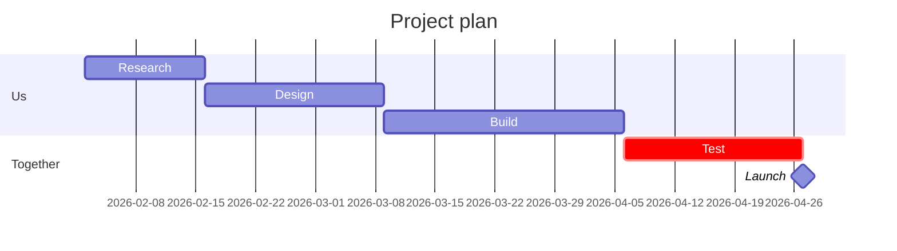

# [The outcome] for [Client].
# Goal: ==[a number the client cares about]== by [date].

Proposal from [your company] to [the client's team], [month year]. Invite the client as an editor: they change the scope on this page, and the agreed version becomes the contract.

## 01 · Where you are
what their data says today

> [!stats]
> - **0%** the metric you will move
> - [!] **0%** where it goes wrong
> - [!] **0** the cause, in a number
> - **\$0** what is at stake

> [!cascade]
> - **100%** the first step
>   who starts
> - **0%** the next step
>   where people leave
> - **0%** the last step
>   who finishes

> [!lineage] What this is worth
> The goal in money: what moving the number is worth to them in a year.

## 02 · What we will do

> [!flow]
> - Research
> - Design
> - Build
> - Test
> - [x] Launch

1. **The first change.** What you do, and why it moves the number.
2. **The second change.** One line each.
3. **The third change.** Three to five in all.

## 03 · Price and terms

> [!cards]
> - **Small · \$0** What is in it.
> - **Medium · \$0** What is in it. Recommended.
> - **Large · \$0** What is in it.

%% table cols="1.6fr 1fr 1fr 1fr" pillCol=2 %%
| Included | Small | Medium | Large |
| --- | --- | --- | --- |
| [First deliverable] | yes | yes | yes |
| [Second deliverable] | no | yes | yes |
| [Third deliverable] | no | no | yes |

**Payment:** how much, and when.

**From you:** what you need from the client, and how fast.

**Valid until:** [date].
