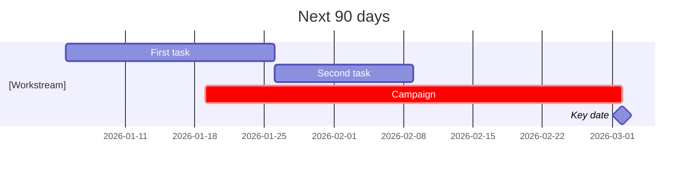

# [Client] × [your company], [Quarter Year].
# [The result they care about] ==[N]%==, [the second result].

Quarterly results for [the client's team]: the goals you set together and what happened, what worked, and the plan for the next 90 days. Add the dates and where the numbers come from.

## 01 · Results against goals

> [!stats]
> - [x] **\$0** the first goal's result, and the goal
> - [x] **\$0** the second goal's result, and the goal
> - **0x** the third one
> - [!] **0** a goal you missed: show it

### By channel

%% table accentCol=3 cols="1.2fr 1fr 1fr 1fr 1.6fr" pillCol=4 %%
| Channel | Spend | Revenue | Return | Next quarter |
| --- | --- | --- | --- | --- |
| [Channel] | \$0 | \$0 | 0x | go: grow it |
| [Channel] | \$0 | \$0 | 0x | keep testing |
| [Channel] | \$0 | \$0 | 0x | stop |

### Your funnel

> [!cascade]
> - **0** visits
>   and where they came from
> - **0** carts or leads
>   the rate from the step above
> - **0** orders or deals
>   the average value

## 02 · What worked, what didn't

### Worked

> [!cards]
> - **What worked** What you did, and the result in a number.
> - **What else worked** Two or three in all.

### Didn't

> [!cards]
> - **What didn't work** Plainly, and what you will do instead.
> - **What is still weak** With a benchmark.

## 03 · Next 90 days

> [!cards]
> - **First recommendation** What changes, and the result you expect.
> - **Second recommendation** One line each.
> - **Third recommendation** Three in all.

> [!lineage] What we need from you
> Approvals, access and answers, each with a date.

1. **[Your company].** What you deliver, and by when.
2. **[Client].** What they deliver, and by when.
3. **Both.** How you check in.

**Next review:** [date], with [what].
