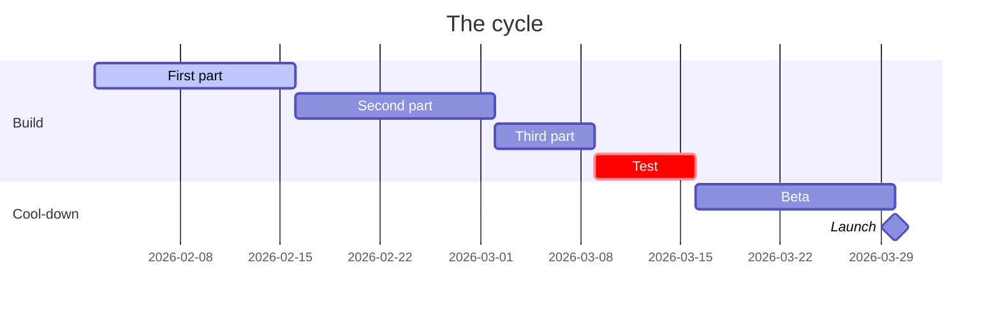

# [Feature] for [product].
# [N] weeks to ==[the outcome]==.

Product brief, written as a Shape Up pitch: the problem, how much time it is worth, the solution, the rabbit holes, and what is out. Add the owner and the reviewers; they comment and edit here, and this page is the spec.

## 01 · Problem
why now

> [!stats]
> - [!] **0%** how often the problem happens
> - [!] **0** what it costs users
> - **0%** what it costs you: tickets, churn
> - **0** lost deals or complaints that name it

> [!lineage] What users tell us
> One real quote, and who said it.

## 02 · Appetite
how much time it is worth

**Appetite:** how many weeks, and who works on it. If it does not fit, cut scope, not add time.

**Done when:** what a user can do at the end, in one sentence.

## 03 · Solution
the shape, not the screens

> [!flow]
> - First step
> - Second step
> - Third step
> - [x] The outcome

%% table cols="1.6fr 100px 1fr" pillCol=2 %%
| Element | Priority | In this cycle |
| --- | --- | --- |
| [The core of it] | P0 | yes |
| [Needed, with a shortcut] | P1 | yes, but [the shortcut] |
| [Nice to have] | P2 | no |

## 04 · Rabbit holes
risks we solve now, before they eat the time

1. **A hard part.** How you avoid getting stuck in it.
2. **Another hard part.** The simple answer you chose.
3. **A technical unknown.** How you will find out early.

## 05 · No-gos
out of this cycle, on purpose

> [!cards]
> - **Not this** Why it is out.
> - **Not that** Why it is out.
> - **Not yet** When it might come.

### How we know it worked

1. **The problem metric.** From what to what, measured how.
2. **The cost metric.** Down by how much, by when.
3. **Adoption.** Who uses it, by when.

