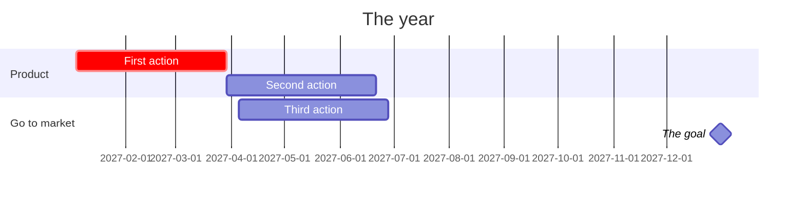

# [Company] in [year].
# [Do this], ==[the one choice]==, not [the alternative].

Strategy memo for [the board, the team], [month year]: the diagnosis, the guiding policy, and the actions that follow from it. Add what the company does in one line.

## 01 · Diagnosis
what is really going on

> [!stats]
> - **\$0** where you are: revenue, growth
> - [!] **0** the number that shows the problem
> - [x] **0** the number that shows the opening
> - [!] **0** what the problem costs

> [!lineage] The problem
> The crux, in three sentences: what is hard, and why the current way does not solve it.

### Options we considered

%% table cols="1.4fr 1.6fr 110px" pillCol=2 %%
| Option | What it means | Verdict |
| --- | --- | --- |
| [Option] | what you would do | No |
| [Option] | what you would do | Go |
| [Option] | what you would do | Later |

## 02 · Guiding policy

**Policy:** one sentence that rules things out: every decision this year serves [whom].

> [!uc]
> - **Stop** what the policy rules out
> - **Stop** another thing
> - **Keep** what stays as it is
> - **Start** what the policy calls for
> - **Start** another thing
> - **Start** a third thing

> [!canvas]
> #### 1 · Customer %%c%%
> - Who you serve
>
> #### 2 · Problem %%p%%
> - Their top problems
> ##### Existing alternatives
> - What they use today
>
> #### 3 · Value proposition %%u%%
> - Why they choose you, in one line
>
> #### 4 · Solution %%s%%
> - What you build
>
> #### 5 · Channels %%h%%
> - How they find you
>
> #### 6 · Revenue %%r%%
> - How you charge
>
> #### 7 · Costs %%k%%
> - Where the money goes
>
> #### 8 · Key metrics %%m%%
> - The numbers you steer by
>
> #### 9 · Unfair advantage %%a%%
> - What others cannot copy

## 03 · Coherent actions
what we do this year

1. **First action, with its quarter.** What it is, and how it follows from the policy.
2. **Second action.** Each one makes the others work better.
3. **Third action.** Three to five in all.

**Goal:** the number at the end of the year, and how you will know the policy worked.
